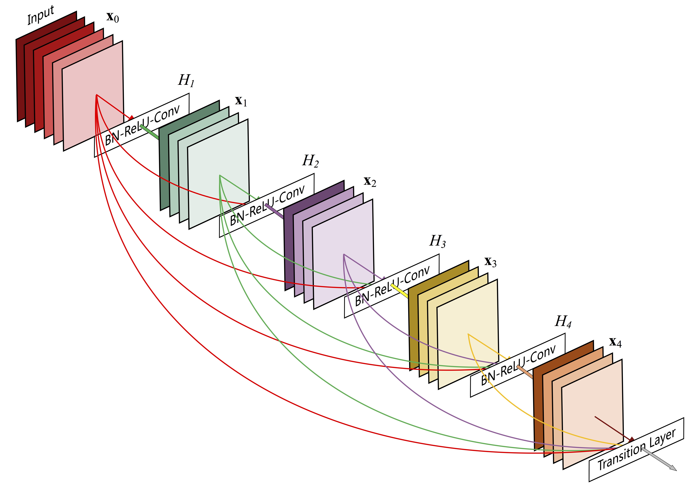
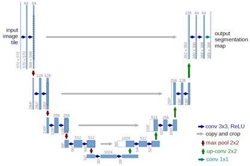
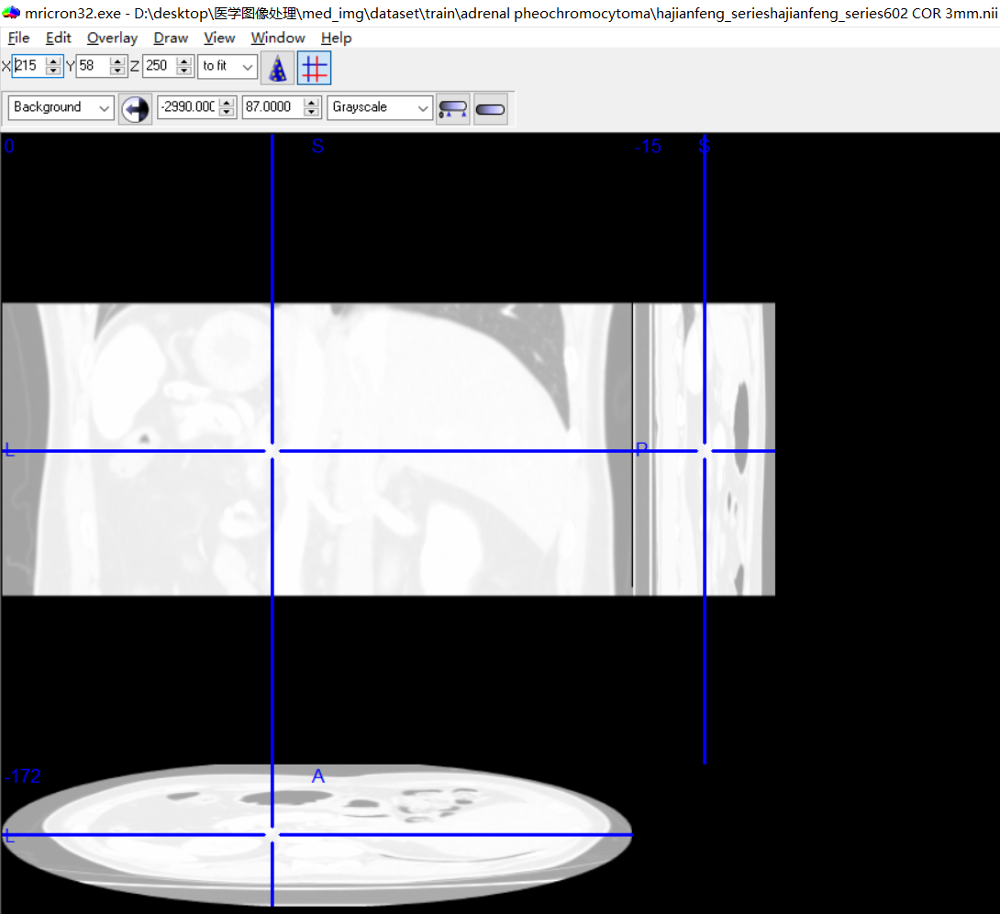

# 基于深度学习的肾上腺肿瘤的诊断与临床决策

## 背景
本研究为医工结合项目，通过采集患者的肾上腺CT和生化指标等临床资料，构建数据库，开展大规模更细致的肾上腺CT图像诊断技术的研发，利用深度学习建立肾上腺肿瘤预测模型，并根据临床指南作出临床决策，完成人工智能系统的研发，实现智能化肾上腺肿瘤的诊疗。辅助临床医生对肾上腺肿瘤做出精准诊断以及超早期预警，并有效提升医生的工作效率，降低经验诊疗的误诊、漏诊率，提高诊断的准确性，进一步提升临床诊疗水平。

## 任务定义
基于图像的医学诊断任务可以细化为图像分类任务和图像分割任务。

### CT图像分类
输入为大小不一的增强CT图像，输出为对应的类别标签。
### CT图像分割

## 核心方法

### 骨干网络（Backbone）选择
#### 图像分类（DenseNet）

#### 图像分割（U-Net）

### 数据集样本不均衡问题及解决方案
使用Focal Loss作为损失函数，多分类任务中的Focal Loss表达如下：

## 数据集

### 肾上腺肿瘤数据集
- 皮质腺瘤213例
- 皮质增生32例
- 嗜铬细胞瘤38例
- 健康100例

每个样本为一个病患的增强CT图像（nii格式），标签包括患病类型和分割标注。数据集存在样本不均衡问题。使用以下命令行对数据集进行预处理，包括解压缩，复制等操作：

    python dataset_prepare.py

使用Micron查看nii格式的原始数据，展示如下：

出于隐私性考虑，实验数据集不予公开。

## 运行
### 环境和依赖
环境：
- Windows10
- CPU/GPU
- Torch

使用pip安装运行程序所需要的依赖项：

    pip install requirements.txt

### 运行程序
训练模型：

- 图像分类

    python classification.py

- 图像分割

    python segmentation.py